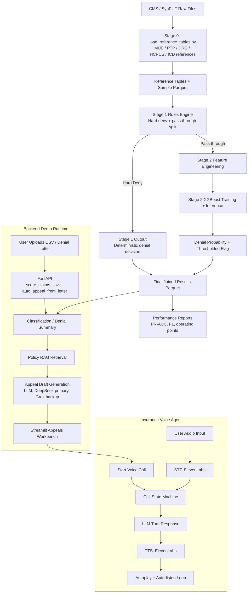

```mermaid
flowchart TD
    A[CMS / SynPUF Raw Files] --> B[Stage 0: load_reference_tables.py<br/>MUE / PTP / DRG / HCPCS / ICD references]
    B --> C[Reference Tables + Sample Parquet]

    C --> D[Stage 1 Rules Engine<br/>Hard deny + pass-through split]
    D -->|Hard Deny| E[Stage 1 Output<br/>Deterministic denial decision]
    D -->|Pass-through| F[Stage 2 Feature Engineering]

    F --> G[Stage 2 XGBoost Training + Inference]
    G --> H[Denial Probability + Thresholded Flag]
    E --> I[Final Joined Results Parquet]
    H --> I

    I --> J[Performance Reports<br/>PR-AUC, F1, operating points]

    subgraph Demo Runtime [Backend Demo Runtime]
        K[User Uploads CSV / Denial Letter] --> L[FastAPI<br/>score_claims_csv + auto_appeal_from_letter]
        L --> M[Classification / Denial Summary]
        M --> N[Policy RAG Retrieval]
        N --> O[Appeal Draft Generation<br/>LLM: DeepSeek primary, Grok backup]
        O --> P[Streamlit Appeals Workbench]
    end

    I --> M

    subgraph Voice Agent [Insurance Voice Agent]
        Q[Start Voice Call] --> R[Call State Machine]
        R --> S[LLM Turn Response]
        S --> T[TTS: ElevenLabs]
        U[User Audio Input] --> V[STT: ElevenLabs]
        V --> R
        T --> W[Autoplay + Auto-listen Loop]
    end

    P --> Q

```